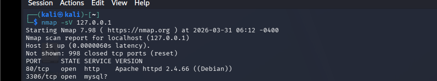
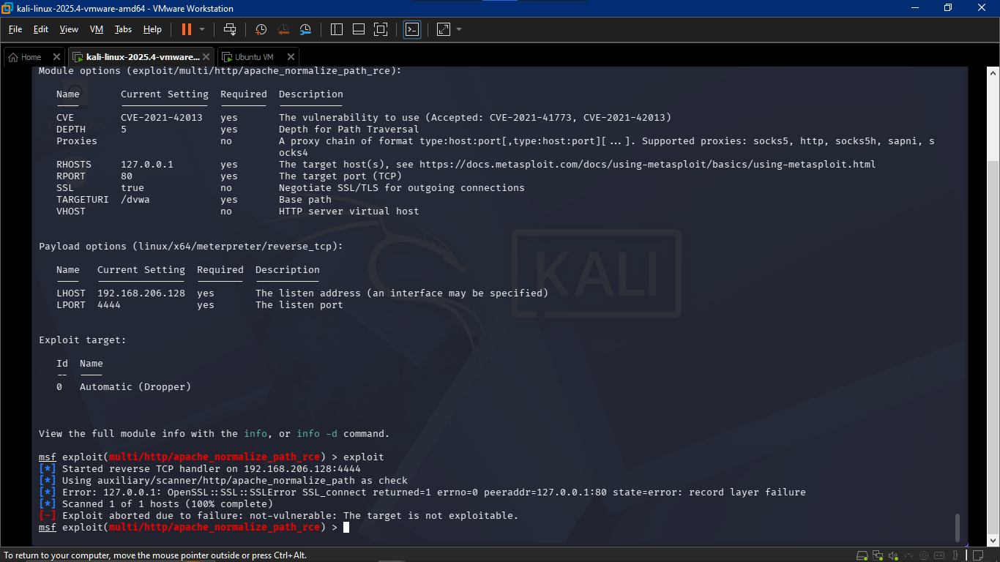
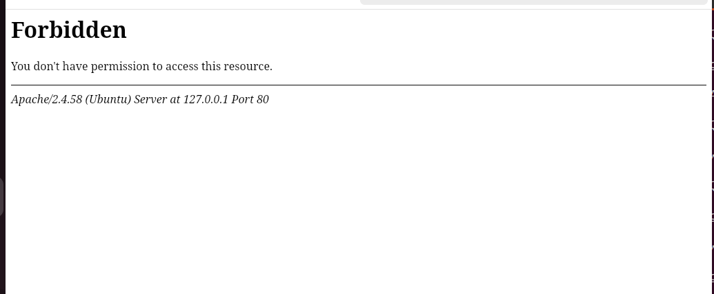
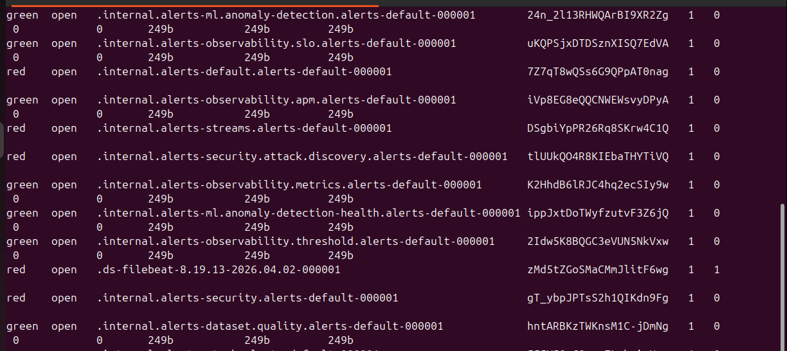
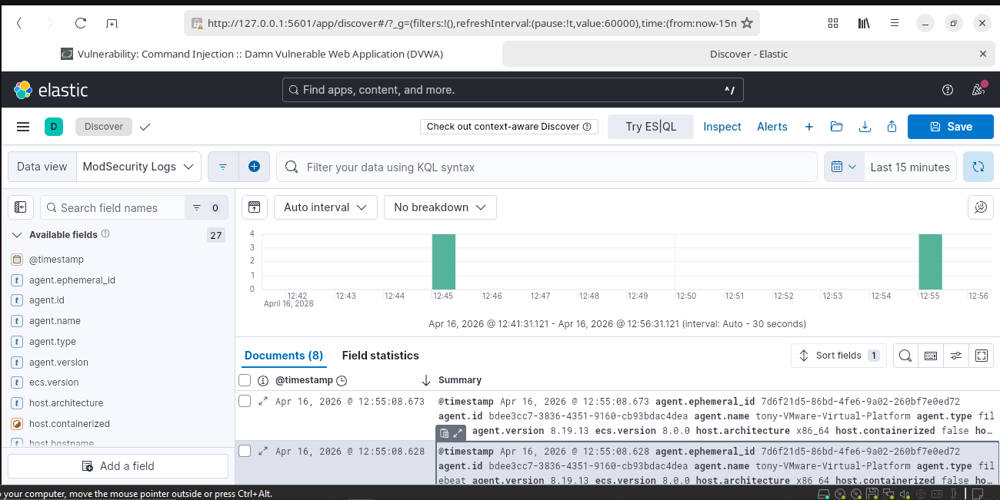

Build, Attack, Defend: Cybersecurity Simulation Project

 Overview
 
This project simulates a small-scale enterprise network to demonstrate the full lifecycle of a cyber attack:
- Deployment of vulnerable systems (DVWA, Cowrie honeypot)
- Attack simulation (Nmap, Metasploit, SQL Injection)
- Defensive mechanisms (ModSecurity WAF, Firewall)
- Monitoring and incident response (ELK Stack)

The goal is to showcase how vulnerabilities can be exploited, detected, and mitigated in a controlled environment.

 Environment Setup
- Attacker Machine: Kali Linux
- Target Server: Ubuntu Server hosting DVWA
- Monitoring Server: ELK Stack
- Honeypot: Cowrie (SSH Honeypot)
- Defensive Control: ModSecurity WAF

 Attack Simulations
- Network Scanning: Nmap revealed open ports (22/SSH, 80/HTTP, 3306/MySQL).
- Exploitation: Metasploit used against DVWA’s command injection vulnerability.
- Web Exploitation: SQL Injection (`' OR '1'='1`) bypassed login authentication.

 Defensive Measures
- ModSecurity WAF: Detected and blocked malicious SQLi attempts.
- Cowrie Honeypot: Captured unauthorized SSH login attempts.
- ELK Stack Monitoring: Centralized logs and dashboards for real-time detection.

Results
- Demonstrated attacker reconnaissance, exploitation, and persistence attempts.
- Defensive tools successfully blocked and logged malicious activity.
- Incident response report generated with actionable recommendations.

 Recommendations
- Enable more Filebeat modules for richer log data.
- Add Kibana alerts for suspicious spikes.
- Integrate honeypot logs directly into Elasticsearch.

  Project Files
- Full report: [doc/BUILD, ATTACK, DEFEND,.pdf](doc/BUILD,%20ATTACK,%20DEFEND,.pdf)

Evidence & Screenshots

1. Reconnaissance
- Nmap scan showing open ports  
  

2. Exploitation Attempts
- Metasploit exploit attempt against DVWA  
  

 3. Web Application Exploitation
- DVWA SQL Injection bypass  
  

 4. Defensive Measures
- ModSecurity blocking malicious SQLi request  
  

 5. Honeypot Activity
- Cowrie honeypot logs capturing unauthorized SSH attempts  
  

 6. Monitoring & Analysis
- ELK Kibana dashboard showing alerts/logs  
  

 Recruiter Note
 
This project highlights hands-on cybersecurity skills in:
- Penetration testing
- Defensive configuration
- Security monitoring
- Incident response

It demonstrates practical knowledge of industry-standard tools (Nmap, Metasploit, ModSecurity, ELK Stack, Cowrie) and the ability to simulate real-world attack/defense scenarios.

